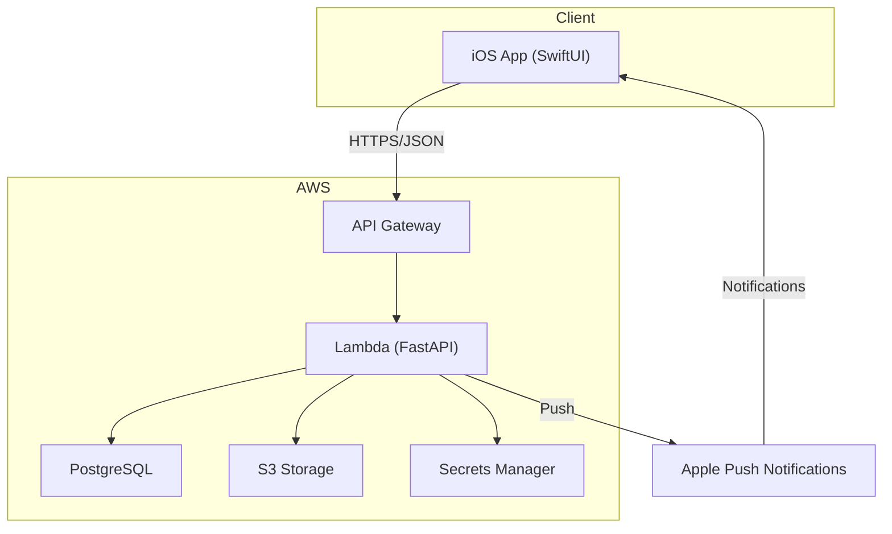

# Puctee Monorepo

A full-stack social planning application with built-in accountability features. This monorepo contains both the FastAPI backend and iOS SwiftUI frontend for Puctee, a platform that helps friends coordinate meetups with location-based check-ins and trust scoring.

## 📁 Repository Structure

```
puctee-mono/
├── puctee-backend/          # FastAPI backend service
│   ├── app/                 # Application code
│   ├── alembic/             # Database migrations
│   ├── tests/               # Backend tests
│   └── README.md            # Backend documentation
│
└── puctee-ios/              # iOS SwiftUI application
    ├── puctee/              # App source code
    ├── puctee.xcodeproj/    # Xcode project
    ├── pucteeTests/         # iOS tests
    └── README.md            # iOS documentation
```

## 🚀 Quick Start

### Prerequisites

**Backend:**
- Python 3.11+
- PostgreSQL 13+
- AWS account (for S3 and other services)

**iOS:**
- macOS
- Xcode (latest stable version)
- iOS 18.5+ (deployment target)

### Setup

#### 1. Clone the Repository

```bash
git clone https://github.com/KojiroTsugaru/puctee-mono.git
cd puctee-mono
```

#### 2. Backend Setup

```bash
cd puctee-backend

# Create virtual environment
python3 -m venv venv
source venv/bin/activate

# Install dependencies
pip install -r requirements.txt

# Configure environment variables
cp .env.example .env
# Edit .env with your credentials

# Run database migrations
alembic upgrade head

# Start the server
uvicorn app.main:app --reload
```

The API will be available at `http://127.0.0.1:8000`

**Backend Documentation:** See [puctee-backend/README.md](./puctee-backend/README.md)

#### 3. iOS Setup

```bash
cd puctee-ios

# Open in Xcode
open puctee.xcodeproj
```

In Xcode:
1. Resolve Swift Package dependencies (`File > Packages > Resolve Package Versions`)
2. Configure environment settings if needed
3. Select a simulator or device
4. Build and run (⌘R)

**iOS Documentation:** See [puctee-ios/README.md](./puctee-ios/README.md)

## 🏗️ Architecture



## ✨ Features

- **User Authentication**: JWT-based secure authentication
- **Friend System**: Send/accept friend requests with bidirectional relationships
- **Plan Management**: Create events, invite participants, track attendance
- **Location Services**: GPS-based check-ins for plan verification
- **Accountability System**: Penalty management with proof submission
- **Trust Scoring**: Gamified reliability tracking based on punctuality
- **Real-time Notifications**: Push notifications via APNs
- **Modern UI**: Built with SwiftUI for native iOS experience

## 🛠️ Tech Stack

### Backend
- **Framework**: FastAPI (Python 3.11+)
- **Database**: PostgreSQL with SQLAlchemy (Async ORM)
- **Authentication**: JWT tokens with bcrypt
- **Notifications**: Apple Push Notification service (APNs)
- **Cloud**: AWS (Lambda, API Gateway, RDS, S3, Secrets Manager)
- **Testing**: pytest

### iOS
- **Language**: Swift
- **UI Framework**: SwiftUI
- **Dependency Management**: Swift Package Manager
- **Security**: Keychain for token storage
- **Networking**: Custom API client with JWT handling

## 🧪 Testing

### Backend Tests
```bash
cd puctee-backend
pytest
# or
./run_tests.sh
```

### iOS Tests
Run tests in Xcode:
- Unit tests: `⌘U`
- UI tests: Select test target and run

## 📚 API Documentation

When the backend is running, visit:
- **Swagger UI**: http://127.0.0.1:8000/docs
- **ReDoc**: http://127.0.0.1:8000/redoc

## 🚢 Deployment

### Backend
The backend is deployed to AWS Lambda using the provided scripts:
```bash
cd puctee-backend
./deploy_app.sh
```

### iOS
Build and distribute via Xcode:
1. Archive the app (`Product > Archive`)
2. Distribute to App Store Connect or TestFlight

## 🤝 Contributing

This is a portfolio project demonstrating:
- Modern full-stack development
- Serverless architecture
- Complex database relationships
- Real-time notifications
- Native iOS development with SwiftUI

## 📝 License

This project is part of a portfolio showcase. Feel free to use as reference for your own projects.

## 📧 Contact

**GitHub**: [@KojiroTsugaru](https://github.com/KojiroTsugaru)

---

**Built with ❤️ using FastAPI, SwiftUI, and modern development practices**
